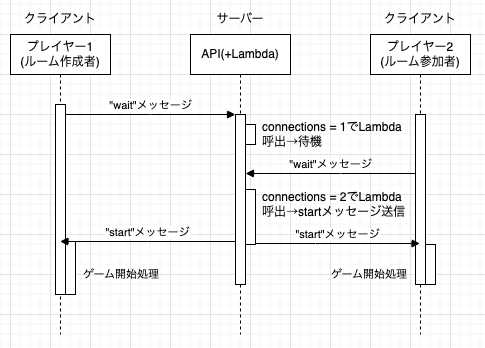

# ゲーム設計

当プロジェクトにおけるゲームの設計について記載する。

## 要件

- ルーム機能によるプレイヤーマッチング

  - 参加者がルームを作成できること
  - 別の参加者がルームに参加できること

- リアルタイム対戦

  - リアルタイムにゲーム画面が更新されること
  - 秒間 10 件程度のイベントを処理できること(ボール発射は 1 秒に 1 回、発射台移動は 1 秒に 3 回程度、得点イベントも合わせて、2 クライアント合計で秒間 10 件程度)

## 採用技術

- API Gateway + DynamoDB + Lambda (サーバーレスアーキテクチャ)

  DynamoDB にルーム情報を持つテーブルを用意し、ルーム作成/ルーム一覧取得/ルーム参加の API を作成した。
  ルーム管理機能で詳細な情報を扱う場合などリレーショナルデータベースの方が適する場合もあると考えるが、今回は項目数も少ないためコストの低い DynamoDB を採用した。

- WebSocket API (API Gateway)

  リアルタイム対戦を実現するために、クライアント・サーバーの双方向通信が可能となる WebSocket API を採用した。
  AWS との相性を考え、API Gateway V2 の WebSocket API を利用した。
  代替案としては ECS などのコンテナ上に WebSocket サーバーを構築する方法もあるが、1 回のゲーム時間が短く利用頻度も少ないため、サーバーレスアーキテクチャの方がコスト面で有利と判断した。

## テーブル設計

DynamoDB テーブルの設計を以下に示す。
Room テーブルでルーム情報を管理し、Connection テーブルで各ルームに参加している WebSocket 接続を管理する。
ゲーム結果は GameHistory テーブルに保存する。

- Room テーブル
  ルーム情報を管理するテーブルである。
  ルーム作成時にレコードが作成され、ルーム参加・終了(中断含む)時に更新される。
  TTL 値により 24 時間経過後 Dynamo DB により自動削除される。

  参考： [DynamoDB での Time to Live (TTL) の使用](https://docs.aws.amazon.com/ja_jp/amazondynamodb/latest/developerguide/TTL.html)

  accessible=true かつ joined=false のルームが、参加可能である。  
  accessible=false のルームは、ゲーム開始後または切断後であることを意味し、参加不可である。  
  タイムアウト処理を簡易にするため、各プレイヤーのスコアも随時更新する設計とした。  
  本ゲームの仕様上、同一行の得点を更新するのは 1 クライアントのみであり、インクリメントで更新するため排他制御は不要と判断した。

  | 項目名              | 型     | 説明                                    |
  | ------------------- | ------ | --------------------------------------- |
  | id                  | String | ルーム ID (パーティションキー)          |
  | accessible          | bool   | ルームにアクセス可能かを示す bool 値    |
  | creatorConnectionId | String | ルーム作成者の Connection テーブルの ID |
  | creatorName         | String | ルーム作成者のユーザー名                |
  | expires_at          | String | TTL 値(Unix 秒)                         |
  | joined              | bool   | ルームに参加者がいるかを示す bool 値    |
  | message             | String | ルーム作成時に設定できるメッセージ      |
  | player1_name        | String | 参加者 1 (ルーム作成者)のユーザー名     |
  | player2_name        | String | 参加者 2 (ルーム参加者)のユーザー名     |
  | player1_score       | Number | 参加者 1 (ルーム作成者)のスコア         |
  | player2_score       | Number | 参加者 2 (ルーム参加者)のスコア         |

- Connection テーブル

  WebSocket 接続情報を管理するテーブルである。  
  WebSocket 接続時にレコードが作成され、切断時に 削除される。いずれも Lambda 関数で処理を行う。

  | 項目名          | 型     | 説明                                           |
  | --------------- | ------ | ---------------------------------------------- |
  | id              | String | WebSocket コネクション ID (パーティションキー) |
  | is_room_creator | bool   | ルーム作成者かを示す bool 値                   |
  | room_id         | String | 参加しているルーム ID                          |
  | player_name     | String | ユーザー名                                     |

- GameHistory テーブル

  ゲーム結果を保存するテーブルである。ゲーム終了時にレコードが作成される。  
  レコードは永続的に保存される。(ゲーム数が少ないため永続保存でも問題ないと判断)

  winner 項目については、通常終了(end_reason=normal_finish)であれば、得点の高いユーザーになる。  
  接続断があった場合(end_reason=disconnect)には、接続が維持されていたユーザーが勝者となる。

  | 項目名        | 型     | 説明                                          |
  | ------------- | ------ | --------------------------------------------- |
  | id            | String | ゲーム ID (パーティションキー)                |
  | end_reason    | String | 終了理由(normal_finish, no_start, disconnect) |
  | game_type     | String | ゲームタイプ(pvp, cpu)                        |
  | end_time      | String | 終了時間                                      |
  | player1_name  | String | 参加者 1 (ルーム作成者)のユーザー名           |
  | player2_name  | String | 参加者 2 (ルーム参加者)のユーザー名           |
  | player1_score | Number | 参加者 1 (ルーム作成者)のスコア               |
  | player2_score | Number | 参加者 2 (ルーム参加者)のスコア               |
  | room_id       | String | ルーム ID                                     |
  | timestamp     | String | レコード作成時間                              |
  | winner        | String | 勝者のユーザー名                              |

## WebSocket イベント設計

ゲーム内での操作については、ゲーム全体に関わるものは WebSocket で情報をリアルタイムに共有することとした。  
基本的には、一方のクライアントからサーバー側に通信を送ると、クライアント側にも情報を共有する。

ただし、ゲームの開始終了を示す start イベント、timeout イベントについては、サーバー側からクライアント側に一方的に送信される。
また、wait イベントについては、クライアント側からサーバー側に一方的に送信される。

なお、通信量および描画速度の観点から、盤面の全部の情報を通信するのではなく、必要なイベントのみを送信することとした。  
イベントを待たずに各クライアントは常時描画を更新している。

point(得点)イベントについては、得点したクライアント側からのみイベントを発行する。
得点したクライアント側からのみとした理由は下記の通りである。

- 得点の二重加算を防止するため

- 得点「された」クライアント側でイベントを発行する設計にしてしまうと、タブを非アクティブにするチートができてしまうため

また得点の更新は、WebSocket サーバー側からのイベントを受け取ったのちに、処理することとした。

| イベント名        | 送信元       | 送信先       | 内容                                               |
| ----------------- | ------------ | ------------ | -------------------------------------------------- |
| wait              | クライアント | サーバー     | ルーム作成または参加時                             |
| start             | サーバー     | クライアント | ゲーム開始(2 人目の参加を確認後サーバー側から通知) |
| ball              | クライアント | サーバー     | じゃんけん発射                                     |
| point             | クライアント | サーバー     | じゃんけんが盤面上部に到達した(得点時)             |
| next_hands        | クライアント | サーバー     | 次の 3 手の表示を更新                              |
| launcher_position | クライアント | サーバー     | 発射台の水平位置                                   |
| cancel            | クライアント | サーバー     | ゲーム中止(接続断)                                 |
| game_timeout      | サーバー     | クライアント | 制限時間到達(ゲームの正常終了)                     |

## ゲーム開始時のシーケンス

ゲーム開始については、両クライアントが揃った時点でサーバーから開始のイベントを送信する。  
当初は 2 人目のゲーム参加からゲーム開始までのタイムラグを最小にすべく、各クライアントで開始する方法も検討したが、  
シーケンスが複雑になるためサーバー側で一括して管理する方式とした。

1. プレイヤー 1 がルームを作成し、wait イベントをサーバーに送信する。
2. プレイヤー 2 がルームに参加し、wait イベントをサーバーに送信する。
3. サーバー側で両者の wait イベントを受信したのち、start イベントを両クライアントに送信する。

## 今後の改善ポイント

- レコード削除のフェールセーフ

Connection テーブルで WebSocket 切断時に処理が失敗した場合には、レコードが削除されて残ってしまう可能性がある。
レコード数も多くないため、懸念は少ないが、データ容量増加時には TTL 削除を検討する。
