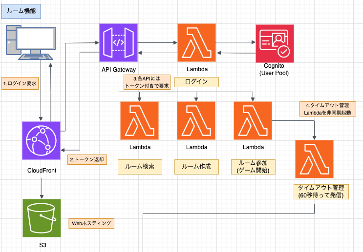
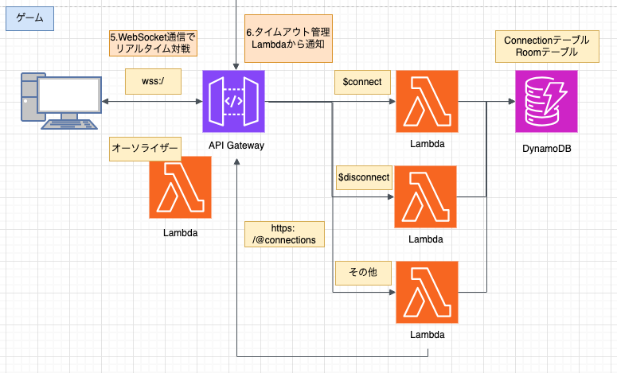
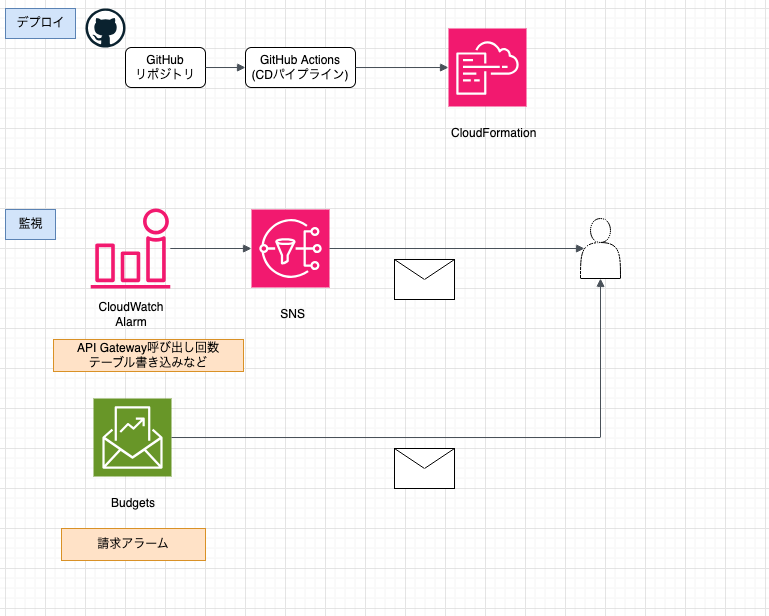
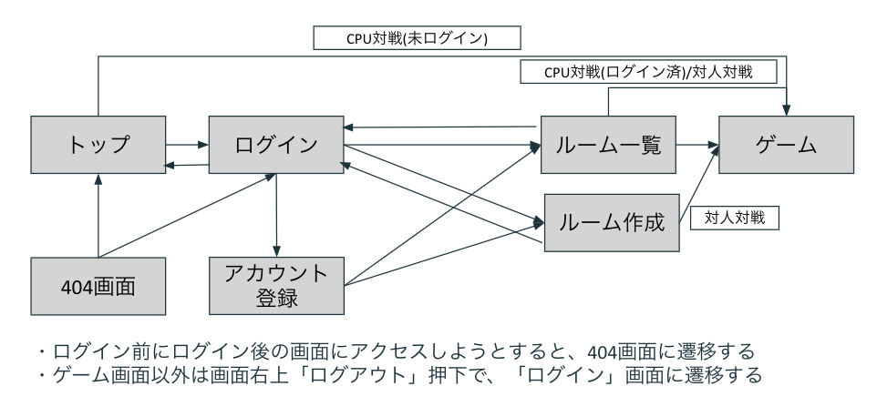

## システム設計 全体

全体的な設計を記載する。

## 要件

- リアルタイムなオンライン 2 人対戦ゲームができること

- ゲームのマッチングのため、ルームの作成および参加ができること

- 対戦相手の識別のため、ユーザー登録ができること

- デプロイが簡単にできること

- 運用コストが安価(月額 10 ドル以下)であること

## システム構成図

リアルタイム対戦に必要な WebSocket API および、Web Hosting の機能、安価な DB(DynamoDB) を提供していることから AWS を利用してサーバーレスアーキテクチャでインフラを構築した。
また、ゲームは Vue.js を用いた SPA として実装した。

- ルーム

- リアルタイム対戦

- デプロイおよび監視(コスト監視含む)

## 画面遷移

ログインからゲーム参加までの画面遷移を以下に示す。

## 各ポイントの設計

各ポイントの設計については、下記の各ドキュメントを参照のこと。

- [認証設計](authentication.md)
- [リアルタイム対戦設計](game.md)
- [デプロイ設計](deploy.md)
- [ログおよび監視設計](monitoring.md)
